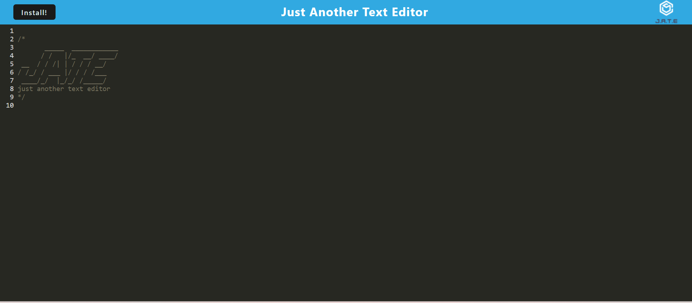

# J.A.T.E.

## Description

  - Uses javascript styling to allow taking notes         
  - Wanted to learn more about PWAs
  - Take notes with JavaScript syntax highlighting!
  - PWAs rely on a service worker and they can be very paticular
        
## Table of Contents        
        
- [J.A.T.E.](#jate)
  - [Description](#description)
  - [Table of Contents](#table-of-contents)
  - [Usage](#usage)
  - [Appearance](#appearance)
  - [License](#license)
  - [Questions](#questions)
        
## Usage
        
Visit: https://pwa-m19-4e3aa0da2cea.herokuapp.com/  
Take notes with JavaScript syntax highlighting!

## Appearance

## License

This application is licensed under the https://opensource.org/licenses/MIT. Click the link for more details.

## Questions

GitHub: [https://github.com/jacslimob](https://github.com/jacslimob)     
Please direct any questions to [jacslimob@gmail.com](mailto:jacslimob@gmail.com).
